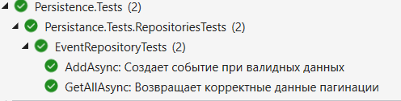
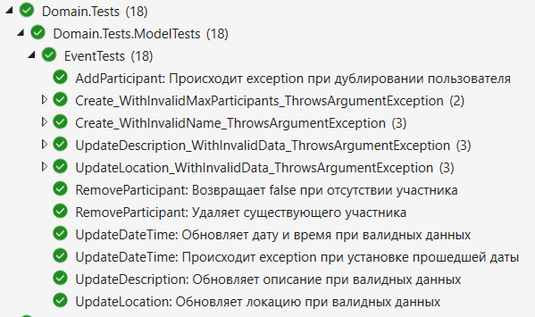
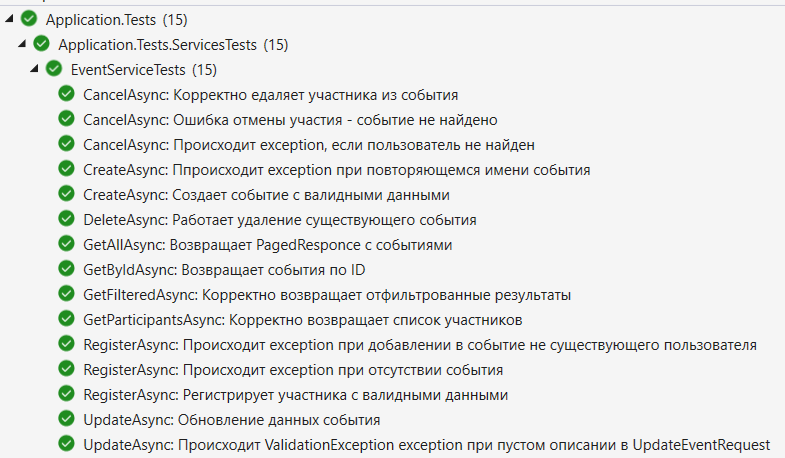

# EventManager Platform

[](https://dotnet.microsoft.com)
[](https://docker.com)
[](https://postgresql.org)

## 📜 Оглавление

1. [🚀 Установка и запуск](#установка-и-запуск)
2. [📦 Архитектура проекта](#-архитектура)
3. [🔐 Аутентификация](#аутентификация-и-авторизация)
4. [✅ Валидация данных](#-валидация-данных)
5. [🧪 Тестирование](#-тестирование)
6. [📺 Демонстрация работы в Swagger](#демонстрация-работы-в-swagger)
---

# Установка и запуск

### 📦 Требования

Перед запуском убедитесь, что установлены:

*   [.NET SDK 9.0](https://dotnet.microsoft.com/en-us/download)
*   [Docker Desktop](https://www.docker.com/products/docker-desktop/)
*   [Visual Studio 2022+](https://visualstudio.microsoft.com/)

### ✅ Клонирование проекта


```bash
git clone https://github.com/Volodya1000/EventManager.git
cd EventManager
```

Выполните 
```bash
Cert\generate-dev-cert.ps1 
```
данный файл создаст сертификат Cert\localhost-dev.pfx


#### 🔁 Способ 1: Запуск через Visual Studio

Открыть решение `EventManager.sln`.

В выпадающем списке запуска выбрать `docker-compose`.

Нажать `F5` или кнопку ▶️ запуска.

В браузере автоматически откроется:

`https://localhost:5001/swagger`

Visual Studio автоматически соберет проект, запустит все сервисы (API, PostgreSQL, Redis), и пробросит порты.

#### 🧪 Способ 2: Запуск через терминал

Убедитесь, что Docker Desktop, и вы находитесь в корне проекта (`EventManager/`)

Выполните команду:
```bash
docker-compose up --build
```
После успешного запуска Swagger будет доступен на:
`https://localhost:5001/swagger`

Для остановки:

```bash
docker-compose down
```
---
    
Вот как выглядят запущенные контейнеры


---

## 🔐 Доступ для администратора

Для тестирования конечных точек, доступных только администраторам, вы можете использовать учётные данные администратора, заданные по умолчанию:

```json
{
  "email": "admin@example.com",
  "password": "StrongPassword123!"
}
```
Этот первый администратор автоматически добавляется в базу данных.

После успешного входа в систему с этими данными, администратор получает доступ к защищённым конечным точкам, а также может назначать права администратора другим пользователям

# 📦 Архитектура

## 🧱 Проекты решения

### 1. `EventManager.WebApi`
- Содержит **Minimal API endpoints**
- Реализован **глобальный обработчик ошибок**
- Настроена **аутентификация и авторизация**
- Конфигурация сервисов и middlewares
- реализован глобальный обработчик ошибок

### 2. `EventManager.Application`
- Реализация **всей бизнес-логики**
- Связующее звено между API и Persistence
- Реализации **сервисов**, **интерфейсы сервисов и репозиториев**
- Определены **запросы** 
- Используется `FluentValidation` для валидации запросов
- Используется `AutoMapper` для преобразования моделей в Dto


### 3. `EventManager.Domain`
- Хранит **доменные модели** и **бизнес-логику**
- Содержит  **интерфейсы репозиториев и UnitOfWork**
- Реализованы правила: например, добавление/удаление участников события
- Валидация происходит через **фабричный метод** (`Create`), а не через публичные конструкторы
- Все коллекции объявлены как `private readonly`, поля — с `private set`
- Используются **кастомные исключения**
- Не зависит от других проектов

### 4. `EventManager.Persistence`
- Слой **инфраструктуры доступа к данным**
- Используется **PostgreSQL** в Docker-контейнере
- Используется **EF Core**, конфигурации сущностей вынесены в классы, реализующие `IEntityTypeConfiguration<T>`
- Реализован паттерн **Unit of Work** для обеспечения транзакционности операций удаления изображений
- Осуществляется маппинг между сущностями базы и DTO/доменными моделями
- Все запросы LINQ к EF Core используют `AsNoTracking`

### 5. `EventManager.Infrastructure`
- Реализация сервиса кеширования и сервиса работы с файлами


По всему стеку вызовов, во всех проектах внедрён CancellationToken:
- позволяет отменять долгие или ненужные операции
- освобождает ресурсы при отмене запроса
## 🧠 Кэширование изображений с помощью Redis

Для кеширования используется **Redis** как распределённое кэш-хранилище для оптимизации работы с изображениями событий.

Сервис `ImageService` реализует методы для загрузки, удаления и получения изображений, связанных с событиями. Redis используется при получении изображений для:

- Уменьшения количества обращений к файловой системе;
- Повышения скорости отклика при повторных запросах;
- Минимизации нагрузки на хранилище.

# 🧪 Тестирование

- Используется **xUnit**
- Библиотеки: 
    - `FluentAssertions` - её преимущество в удобном синтаксисе (формат написания проверки субъект -> действие -> объект более привычен для людей). Другим плюсом является информативность сообщений, который встроены по умолчанию
    -   библиотека `Moq`
- Используется **InMemoryDatabase**
- Реализованы тесты для модели события:
  - Для бизнес-логики модели события
  - Для всех слоев: Application, Persistence, Domain
- Проект `Application.Tests`:
  - Тестируется `EventService`
  - Используется `EventTestFactory` для создания моков,  данных пользователей и событий по умолчанию

## Тесты EventRepository


## Тесты моедли Event


## Тесты EventService

---
# ✅ Валидация данных

Валидация происходит на нескольких уровнях в разных слоях проекта:

### 1. Валидация запросов

- Используется **FluentValidation** для валидации входящих запросов (например, регистрация пользователя, создание события и т.д.).
- При проверке ограничений, таких как **длина строк**, используются **константы**, определённые в **доменных моделях**.
- Все валидаторы находятся в проекте `EventManager.Application`.

### 2. Валидация доменных моделей

- Создание экземпляров доменных моделей осуществляется через  `Create(...)`.
- Внутри метода `Create` проверяется корректность переданных параметров..

### 3. Проверка правил бизнес логики

- Вся бизнес логика проверяется толко в проекте `EventManager.Application`. Благодаря этому конечные точки остаются тонкими и репозитории не захламлены проверками


# Аутентификация и авторизация
В проекте реализована безопасная система аутентификации на основе JWT-токенов и токенов обновления.

Используется Microsoft.AspNetCore.Identity

---

## 🔒 Процесс аутентификации

### 1. Регистрация
- Пользователь предоставляет: email, пароль, имя, фамилию, дату рождения.
- Пароль валидируется по правилам ASP.NET Identity:
  - Минимум 8 символов
  - Обязательные: заглавная буква, строчная буква, цифра, специальный символ
- При успешной регистрации:
  - Создается запись пользователя
  - Назначается роль User по умолчанию

### 2. Вход в систему
- Пользователь вводит email и пароль
- Проверка учетных данных через Identity
- При успехе:
  - Генерируются:
    - JWT-токен доступа 
    - Токен обновления 
  - Токены сохраняются в HTTP-only куки
  

### 3. Генерация токенов
- **JWT Access Token:**
  - Содержит: ID пользователя, email, имя, роли
  - Подписывается симметричным ключом из конфигурации
  

### 4. Обновление токенов
- Клиент отправляет истекший `access token` и валидный `refresh token`
- Система проверяет:
  - Существование `refresh token` в базе
  - Срок действия `refresh token`
- При успехе:
  - Выдаются новые `access` и `refresh` токены

---

## 🛡️ Авторизация

- Реализована ролевая модель доступа через ASP.NET Identity
- Эндпоинты защищаются атрибутами: `[Authorize(Roles = "Admin")]`
- Системные роли:
  - `User` — базовые права
  - `Admin` — расширенные привилегии (назначение ролей и добавление, редактирование событий, категорий)

Назначение прав администратора:
- Существующие админы могут повышать пользователей по email
- После назначения:
  - Пользователь добавляется в роль `Admin`
  - Текущие сессии сохранят старые права до обновления токенов

# Демонстрация работы в Swagger
## Повышение пользователя до администратора


## Получение изображения  (используется кеширование redis)


## Загрузка изображения


## Получение событий с пагинацией


